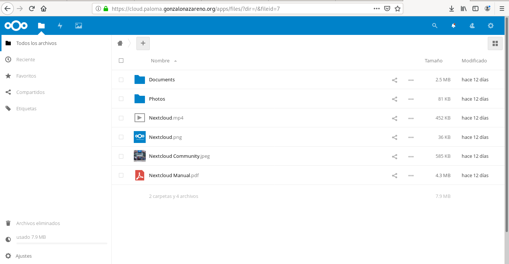

# HTTPS
El siguiente paso de nuestro proyecto es configurar de forma adecuada el protocolo HTTPS en nuestro servidor nginx para nuestras dos aplicaciones web. Para ello vamos a emitir un certificado wildcard en la AC Gonzalo Nazareno utilizando para la petición la utilidad "gestiona".

- Debes hacer una redirección para forzar el protocolo https.

Se instala openssl:
~~~
[centos@salmorejo ~]$ sudo dnf install mod_ssl
~~~

Se crea la clave:
~~~
[centos@salmorejo ~]$ sudo openssl genrsa -out gonzalonazareno.pem 4096
Generating RSA private key, 4096 bit long modulus (2 primes)
........................................++++
................................................................................................................................++++
e is 65537 (0x010001)
~~~

Y se crea un fichero llamado paloma.gonzalonazareno.org.conf para la configuración del certificado:
~~~
[req]
default_bits = 4096
prompt = no
default_md = RSA
distinguished_name = dn

[ dn ]
C=ES
ST=Sevilla
L=Dos Hermanas
O=IES Gonzalo Nazareno
OU=Informatica
emailAddress=palomagarciacampon08@gmail.com
CN = *.paloma.gonzalonazareno.org
~~~

Y se crea el fichero .csr y la clave:
~~~
sudo openssl req -new -sha256 -nodes -out paloma.gonzalonazareno.org.csr -newkey rsa:4096 -keyout gonzalonazareno.pem -config paloma.gonzalonazareno.org.conf
~~~

### Tras obtener el certificado firmado
Se mueve el certificado y la clave al directorio /etc/pki/tls/certs/ y private/ respectivamente:
~~~
[centos@salmorejo ~]$ sudo mv paloma.gonzalonazareno.org.c* /etc/pki/tls/certs/
[centos@salmorejo ~]$ sudo mv gonzalonazareno.pem /etc/pki/tls/private/
~~~

Y se añaden o modifican las siguientes líneas en el nuevo fichero:
~~~
server {
    listen 80;
    server_name  www.paloma.gonzalonazareno.org;
    rewrite ^ https://$server_name$request_uri permanent;
}

server {
    listen 443;
    server_name  www.paloma.gonzalonazareno.org;
    ssl on;
    ssl_certificate /etc/pki/tls/certs/paloma.gonzalonazareno.org.crt;
    ssl_certificate_key /etc/pki/tls/private/gonzalonazareno.pem;
~~~

Además, hay que indicar a Selinux que debe permitir que nginx pueda acceder al directorio que contiene la clave y el certificado:
~~~
sudo restorecon -v -R /etc/pki/tls/
~~~

Y se descomenta la parte de https del fichero /etc/nginx/nginx.conf:
~~~
    server {
        listen       443 ssl http2 default_server;
        listen       [::]:443 ssl http2 default_server;
        server_name  _;
        root         /usr/share/nginx;

        ssl_certificate "/etc/pki/tls/certs/paloma.gonzalonazareno.org.cr$
        ssl_certificate_key "/etc/pki/tls/private/gonzalonazareno.pem";
        ssl_session_cache shared:SSL:1m;
        ssl_session_timeout  10m;
        ssl_ciphers PROFILE=SYSTEM;
        ssl_prefer_server_ciphers on;
        location / {
        }

        error_page 404 /404.html;
            location = /40x.html {
        }

        error_page 500 502 503 504 /50x.html;
            location = /50x.html {
        }
    }

}
~~~

Puede que el firewalld se interponga en la conexción. Para solucionarlo:
~~~
sudo firewall-cmd --zone=public --add-port=443/tcp --permanent
sudo firewall-cmd reload
sudo systemctl restart firewalld
~~~

